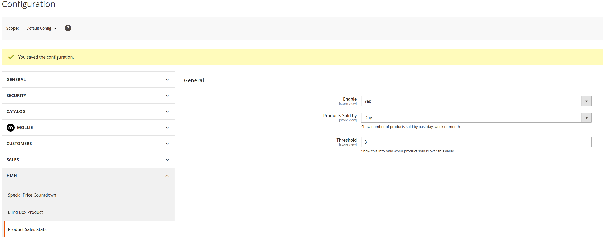
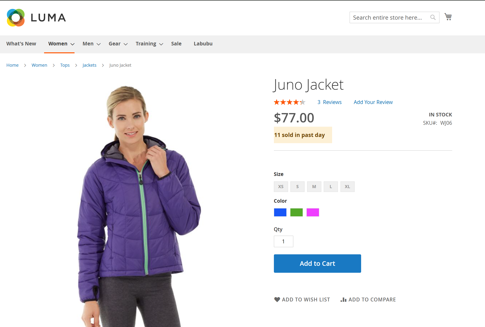

# Hmh ProductSalesStats

Adds a storefront message that shows how many units were sold in a configurable recent period.

## Features
- Injects sales stats into the product JSON config.
- Displays "X sold in past Y" on product price boxes when product sales in given period is over the threshold
- Configurable period and threshold in admin settings.

## Configuration
- Stores -> Configuration -> HMH -> Product Sales Stats
- Set Enabled, Period, and Threshold.

## How-to

